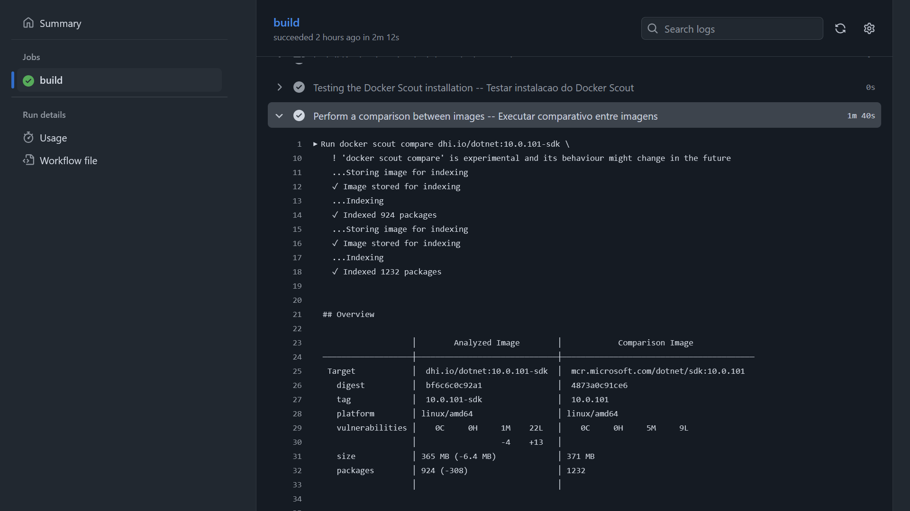
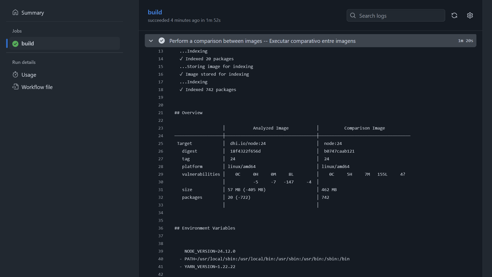
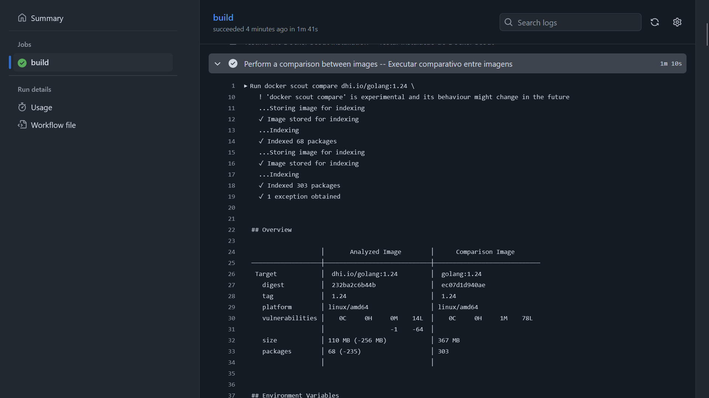

# githubactions-docker-hardened-images-comparisons
Workflow do GitHub Actions para testes comparando a segurança de imagens convencionais e Docker Hardened Images (DHI) via utilitário docker scout.

*GitHub Actions workflow for testing and comparing the security of conventional images and Docker Hardened Images (DHI) using the docker scout utility.*

---

## Testes

Exemplo de execuçao do workflow com imagens do **Python 3.13**:

Exemplo de execuçao do workflow com imagens do **.NET 10**:

Exemplo de execuçao do workflow com imagens do **Node 24**:

Exemplo de execuçao do workflow com imagens do **Go 1.24**:

