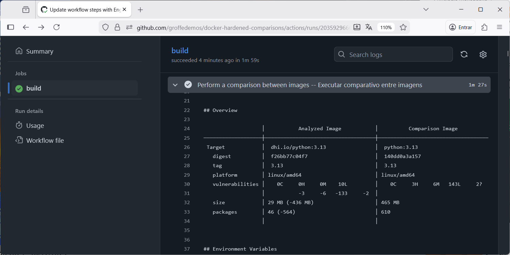

# githubactions-docker-hardened-images-comparisons
Workflow do GitHub Actions para testes comparando a segurança de imagens convencionais e Docker Hardened Images (DHI) via utilitário docker scout.

---

## Testes

Exemplo de execuçao do workflow com imagens do **Python 3.13**:

